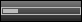
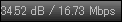
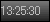

# ステータスバー

画面下に表示されるステータスバーによって、各種の情報表示と操作が行えます。

ステータスバーには以下の項目を表示することができます。  
| 項目| 表示内容| 左クリック| 右クリック  
---|---|---|---|---  
| チューナー| 現在のチューナー| チューニング空間/ドライバ選択|
チューニング空間/ドライバからチャンネル選択  
| チャンネル| 現在のチャンネル| チャンネル選択| サービス選択  
| お気に入り| | お気に入りメニュー| お気に入りに追加  
| 映像サイズ| 幅 x 高さ (倍率)| 表示倍率選択| アスペクト比選択  
| 音量| 現在の音量| 音量の変更| 消音  
| 音声| 現在のモード| 音声切替| 音声切替メニュー  
| 録画| 現在の録画状況| 録画開始/停止| 録画メニュー  
| キャプチャ| | キャプチャ実行| キャプチャメニュー  
| エラー| ドロップ(D) / エラーパケット(E) / 暗号化パケット(S)| リセット|  
| 信号レベル| 感度 / ビットレート| |  
| 時計| 現在の時刻| PC/TOT時刻の切り替え| メニュー  
| 番組情報| 現在の番組の情報| 現在/次の番組の切り替え| メニュー  
| バッファリング| BonDriverのバッファ残量(R) / バッファ使用率(B)| |
バッファリングメニュー  
| ビットレート| 映像ビットレート(V) / 音声ビットレート(A)| |  
  
ステータスバーのチャンネル/音量/音声の各項目にフォーカスがある状態でホイールを使用すると、その項目に合わせた動作をします。

ステータスバーの項目の順序、表示/非表示、大きさは[設定](options/statusbar.md)で変更することができます。  

